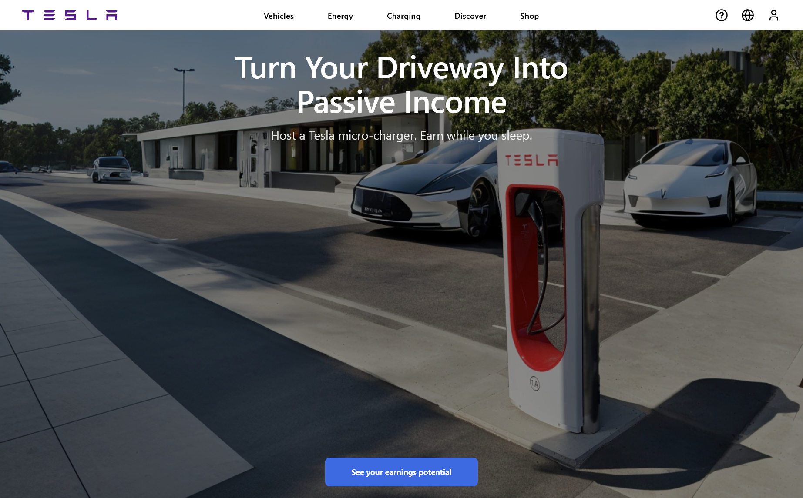
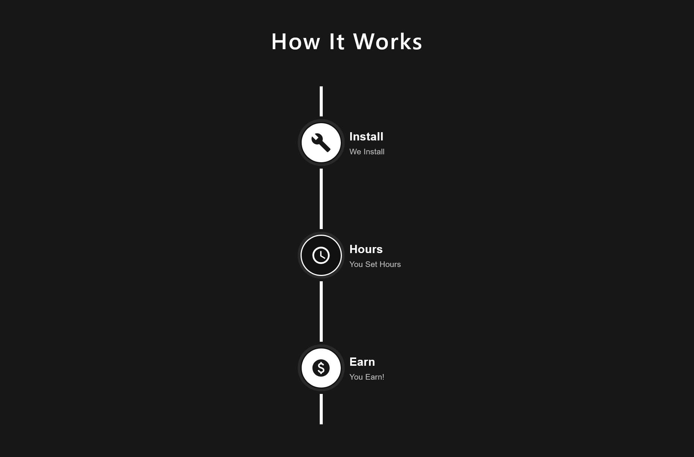
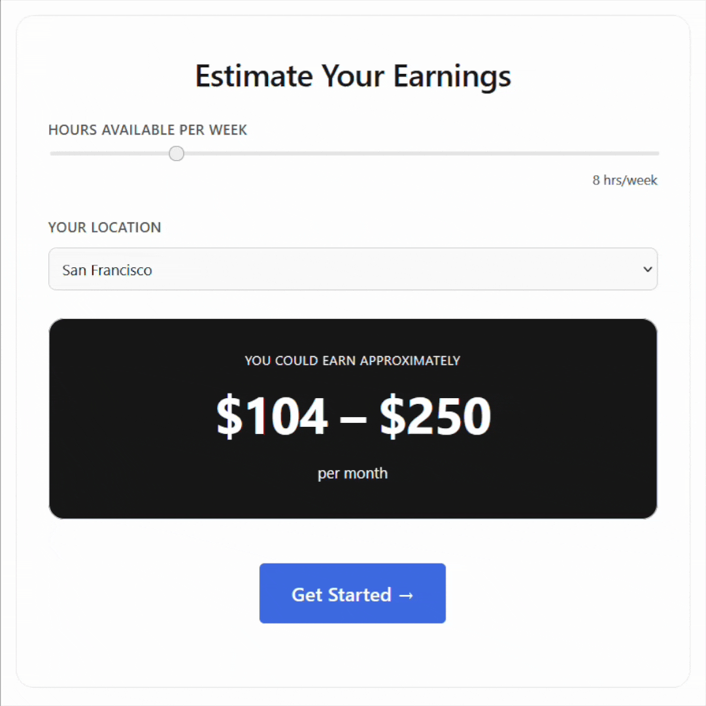
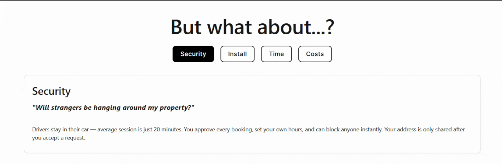

# Tesla Neighborhood Charging Program — Landing Page

A persuasive landing page built in **2 hours** for a frontend hackathon, educating homeowners on hosting Tesla micro-chargers and earning passive income.

🏆 **Placed 2nd at HAVK Web Development Competition** — Recognized for storytelling, brand consistency, and visual hierarchy.

[Live Demo](https://tesla-neighborhood-charging-landing.vercel.app/)

---

## 🎯 The Challenge

**Topic:** Create a landing page for Tesla's Neighborhood Charging Program

**Time Limit:** 2 hours

**Problem:** Homeowners assume hosting a charger is complicated or invasive — adoption is low.

**Goal:** Build a single-page site that overcomes objections and drives sign-ups.

---

## 🧠 Strategy

Rather than just listing features, I built a **persuasion arc**:

1. **Hook** → Lead with the benefit: "Turn your driveway into passive income"
2. **Social proof** → Real numbers build credibility
3. **How it works** → Demystify with a simple 3-step timeline
4. **Objections** → Address concerns directly (privacy, installation, time, costs)
5. **Engagement** → Interactive earnings calculator personalizes the pitch
6. **CTA** → Low-friction next steps

---

## 🎨 Design Decisions

### Branding

- Stuck to **Tesla's minimalist aesthetic**: black, white, gray, with blue CTAs
- Avoided trendy styles that would clash with Tesla's identity
- Used actual Tesla navigation structure for seamless integration

### Visual Hierarchy

- **Hero** → Full-screen with lifestyle imagery<br>


- **Timeline** → Vertical flow on dark background for visual contrast<br>


- **Calculator** → Centerpiece with dark card to draw attention<br>


- **Tabs** → Clean tab switching for objections (no accordion overload)<br>


### Interaction

- Live earnings calculation based on slider input
- Tab switching for objections
- Subtle fade animations on content sections

---

## 🛠️ Tech Stack

- **React** (Vite) — Fast setup, clean state management for interactive components
- **Vanilla CSS** — Custom slider styling for polish

### Why React for a static page?

The earnings calculator and objection tabs justified the overhead. Managing slider state and tab switching is cleaner with `useState` than vanilla DOM manipulation.

---

## 📊 Components

```
src/
├── assets/
│   └── hero-background.jpeg
├── components/
│   ├── Calculator.jsx       # Interactive earnings estimator
│   ├── Calculator.css
│   ├── FinalCTA.jsx         # Dual CTAs (Qualify + Schedule)
│   ├── FinalCTA.css
│   ├── Footer.jsx           # Site footer
│   ├── Footer.css
│   ├── Hero.jsx             # Full-screen hero with CTA
│   ├── Hero.css
│   ├── HowItWorks.jsx       # 3-step timeline visualization
│   ├── HowItWorks.css
│   ├── Navbar.jsx           # Tesla navigation bar
│   ├── Navbar.css
│   ├── Objections.jsx       # Tabbed FAQ addressing concerns
│   ├── Objections.css
│   ├── Stats.jsx            # Social proof cards
│   └── Stats.css
├── App.jsx                  # Main layout and component composition
├── App.css
├── index.css                # Global styles and Tesla brand variables
└── main.jsx                 # React entry point
```

---

## ⚡ Key Features

- **Interactive Calculator** — Users see personalized earnings in real-time
- **Objection Handling** — Tabs for Security, Install, Time, Costs
- **Responsive Design** — Mobile-friendly layout
- **Tesla-Accurate Branding** — Matches official site aesthetic

---

## 🚀 Running Locally

```bash
# Clone the repo
git clone https://github.com/dganesh05/tesla-neighborhood-charging-landing.git
cd tesla-neighborhood-charging-landing

# Install dependencies
npm install

# Run dev server
npm run dev
```

---

## 📈 What I Learned

**Time management:** Prioritized the structure calculator (highest impact) over polish like animations

**Decision framework:** When in doubt, I asked: "Does this serve the persuasion arc?"

**Branding discipline:** Resisted adding "cool" features that would break Tesla's minimal aesthetic

---

## 🎓 Hackathon Feedback

**Strengths:**

- Clear storytelling and persuasive flow
- Timeline visualization made the process feel simple
- Calculator engagement hook was effective
- Brand consistency with Tesla's actual site

**Improvement:**

- Could've added a secondary page (e.g., detailed FAQ or About)

---

## 📝 License

[MIT License](LICENSE.md) — feel free to use this as a template for your own landing pages!

---

Built with ⚡ in 2 hours by [Divya Ganesh](https://github.com/dganesh05)
